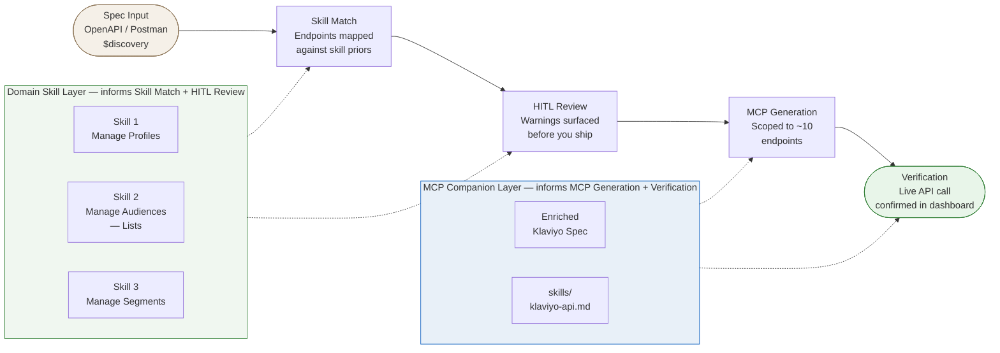
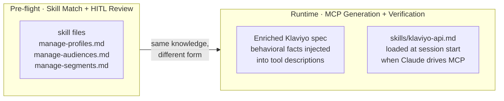

# Architecture: AI-Assisted Martech Integration Builder

An AI agent takes a structured API spec, applies codified domain knowledge ("skills") to match and interrogate it, surfaces a human-in-the-loop review, generates a scoped MCP server, and verifies the result with a live API call — demonstrating that AI can accelerate and de-risk martech integration work.

**Platform:** Klaviyo (free tier) · **Three skills:** Manage Profiles · Manage Audiences — Lists · Manage Segments

---

## Pipeline



---

## The Three Skills

Each skill encodes priors about how a category of integration typically behaves — not just what the spec says, but what will bite you that the spec doesn't mention.

| Skill | What it covers | Key gotcha |
|---|---|---|
| **Skill 1 — Manage Profiles** | Upsert, delete (compliance job), download-all (paginated loop) | Delete is async and irreversible; known 401 post-revision-bump on Data Privacy endpoint |
| **Skill 2 — Manage Audiences — Lists** | Create list, add member (two paths), remove member, delete list | Two add-member endpoints with different consent semantics — both return 200, only one actually adds anyone |
| **Skill 3 — Manage Segments** | Create segment (rule-based), read, delete; membership = computed | No add-member endpoint by design; empty segment = data quality problem, not config error |

### Why Lists and Segments are separate skills

Lists hold **manually-curated, writable** membership — someone is in a list because a human or system put them there. Segments hold **computed, non-writable** membership — a profile is in a segment because it matches a rule evaluated against its data. Conflating them (especially trying to "add a member" to a segment) is one of the most common martech integration mistakes.

---

## Two-Layer Skill Delivery

Skills work at two points in the pipeline:



The companion skill (`skills/klaviyo-api.md`) carries the same domain knowledge that powered the HITL review — repurposed as per-tool LLM guidance at call time. The skill's value doesn't end at the review screen.

---

## Cross-Skill Causation

The three skills are not independent. Profile data (Skill 1) drives segment membership (Skill 3), without any list operation (Skill 2). This is the core CDP value proposition made visible.

```mermaid
sequenceDiagram
    participant P as Skill 1&#58; Manage Profiles
    participant K as Klaviyo API
    participant S as Skill 3&#58; Manage Segments

    S->>K: POST /api/segments<br/>{rule: properties.vip_tier = "gold"}
    K-->>S: segment_id

    P->>K: POST /api/profiles<br/>{properties.vip_tier: "gold"}
    K-->>P: profile_id

    Note over K: ~30 seconds: segment recomputation

    S->>K: GET /api/segments/{id}
    K-->>S: 1 member ✅

    Note over P,S: No add-member call — profile data drove segment membership
```



---

## Component Map

```
docs/
├── architecture.md          ← this file
├── brd.md                   ← business requirements
├── fsd.md                   ← functional specification (10 sections)
└── superpowers/specs/
    └── 2026-06-27-martech-integration-builder-design.md

skills/                      ← to be built
├── manage-profiles.md       ← Skill 1 domain priors
├── manage-audiences.md      ← Skill 2 domain priors (Lists)
├── manage-segments.md       ← Skill 3 domain priors (Segments)
└── klaviyo-api.md           ← MCP companion (all three skills, runtime form)

06-end-to-end-flow.html      ← 5-screen clickable prototype (Spec Input → Verification)
05-architecture.html         ← standalone architecture diagram
04-manage-profiles-and-audiences-klaviyo.html  ← skill reference prototype
```

---

## References

- [Business Requirements Document](brd.md)
- [Functional Specification](fsd.md)
- [Design Doc](superpowers/specs/2026-06-27-martech-integration-builder-design.md)
