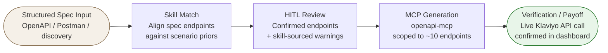

# Functional Specification Document
## AI-Assisted Martech/Adtech Integration Builder

**Version:** 1.0  
**Date:** 2026-06-27  
**Status:** Draft — pending review  
**References:** [Business Requirements Document](brd.md) · [Handoff Spec](../handoff-spec.md)

---

## 1. Overview & System Context

This system accepts a structured API spec (OpenAPI / Postman / `$discovery`), matches it against a domain-knowledge "skill" for the requested integration scenario, presents a human-in-the-loop review of confirmed endpoints and skill-sourced warnings, generates a scoped MCP server, and verifies the result with a live API call.

**Auth:** All Klaviyo API calls use a private API key passed as `Authorization: Klaviyo-API-Key {key}`, sourced from environment variable — never hardcoded.

---

## 2. Scenario: Manage Profiles (Skill 1)

### 2.1 What the skill knows

The Manage Profiles skill encodes priors about how profile management APIs typically behave:

- **Upsert** is almost always idempotent by a natural key (email, phone, external ID) — there is rarely a separate create vs. update endpoint. No error on re-send; silent overwrite.
- **Delete** in regulated contexts is almost never a synchronous `DELETE` on the profile resource. It's a privacy/compliance job submission — async, irreversible, rate-limited far below write limits.
- **Download all** is never a single bulk-export endpoint in REST APIs. It's always a paginated loop. If the spec appears to offer a single bulk endpoint, it's either a report (async, not real-time) or documentation is misleading.

### 2.2 Klaviyo endpoint mapping

| Operation | Endpoint | Method | Spec-confirmed |
|---|---|---|---|
| Upsert | `/api/profiles` | POST | ✅ |
| Delete | `/api/data-privacy-deletion-jobs` | POST | ✅ |
| Download all | `/api/profiles` | GET (paginated) | ✅ |

### 2.3 HITL review output — Manage Profiles

The review screen for this scenario shows confirmed endpoints (no inference, no guessing) plus the following skill-sourced warnings:

| Severity | Warning |
|---|---|
| 🟡 Behavioral | **Upsert is silent.** No distinct create vs. update — sending the same email/phone/external_id again overwrites the existing profile with no error and no duplicate. Design your pipeline accordingly. |
| 🔴 Destructive | **Delete is async and irreversible.** `POST /api/data-privacy-deletion-jobs` submits a deletion request; the profile is not gone immediately. There is no soft-delete, no undo. Rate limit: burst 3/s, steady 60/min — far tighter than profile writes. |
| 🔴 Live issue | **401s on delete after an API revision bump are not bad-key errors.** A confirmed April 2026 community thread documents intermittent 401s from the Data Privacy endpoint immediately after a Klaviyo API revision change, with a valid working key. Suspected cause: scope/permission change tied to the revision. If this happens, wait and retry before rotating keys. |
| 🟡 Behavioral | **"Download all" = paginated loop.** No single bulk-export endpoint exists in the Klaviyo API. Follow `links.next` until exhausted. Dashboard has a per-profile GDPR export button, but that's UI-only and not accessible via API. |

### 2.4 Dropped operation

"Delete all" bulk operation is explicitly out of scope — too platform-divergent (typically resolves to a workaround, not a real endpoint), not worth the complexity for this demo.

---

## 3. Scenario: Manage Audiences (Skill 2)

### 3.1 What the skill knows

The Manage Audiences skill encodes priors about audience management APIs:

- **Lists vs. Segments** is a near-universal distinction: static/manually-curated vs. dynamic/rule-based. Most platforms implement both. The failure mode is conflating them — especially trying to "add a member" to a dynamic segment.
- **List membership add** is one of the highest-gotcha operations in martech — multiple consent paths often exist with different downstream behavior, and the API surface may not make the distinction obvious.
- **Segment membership** is computed, not writable. There is no add/remove endpoint by design. To change who's in a segment, change the rule. This surprises developers who expect CRUD-style membership management.
- **Rate limits on segment creation** are typically much tighter than on reads or list operations, because segments trigger compute jobs.

### 3.2 Klaviyo endpoint mapping — Lists (static)

| Operation | Endpoint | Method | Spec-confirmed |
|---|---|---|---|
| Create list | `/api/lists` | POST | ✅ |
| Add member | `/api/lists/{id}/relationships/profiles` OR `/api/lists/{id}/subscribe` | POST | ✅ (two paths) |
| Remove member | `/api/lists/{id}/relationships/profiles` | DELETE | ✅ |
| Delete list | `/api/lists/{id}` | DELETE | ✅ |

### 3.3 Klaviyo endpoint mapping — Segments (dynamic)

| Operation | Endpoint | Method | Notes |
|---|---|---|---|
| Create segment | `/api/segments` | POST | ✅ |
| Read segment | `/api/segments/{id}` | GET | ✅ |
| Add/remove member | — | — | Not applicable by design |
| Delete segment | `/api/segments/{id}` | DELETE | ✅ (spec-confirmed, lower research depth than other ops) |

### 3.4 HITL review output — Manage Audiences

| Severity | Warning |
|---|---|
| 🔴 Critical | **Two add-member endpoints exist with different consent semantics.** `relationships/profiles` adds immediately but does not grant marketing consent. `subscribe` is consent-aware but if double opt-in is enabled (Klaviyo's default), it returns a successful empty response and adds no one until the contact confirms. Both calls look identical in success/failure shape — only the real-world outcome differs. |
| 🔴 Critical | **Adding to a list requires a profile ID, not an email.** For a net-new contact, this is a 2-step sequence: resolve/create the profile first (get back an ID), then add by ID. The Bulk Profile Import API can do both in one call as an alternative. |
| 🟡 Behavioral | **Removing from a list does not change subscription/consent status.** A profile removed from all lists can still be technically subscribed to marketing. Use the Unsubscribe endpoint if the goal is to stop marketing communications, not just list membership. |
| 🟡 Behavioral | **Segment creation has a daily cap of 100/day** (burst 1/s, steady 15/min). A loop that creates segments will exhaust the daily quota fast, and the failure pattern won't look like a typical rate-limit error until most of the quota is gone. |
| ℹ️ Historical | **Segment creation via API is relatively new.** This endpoint didn't exist for years — it was dashboard-only. If any cached documentation or SDK says "segment creation not supported via API," it's outdated. |
| ℹ️ N/A by design | **No add/remove-member endpoint for segments.** Segment membership is computed continuously from the segment's rule definition. Profiles enter/exit automatically as they match/unmatch conditions. To change membership, change the rule (Update Segment). |

### 3.5 Bridge operation: Segment snapshot → List

Captures everyone currently matching a segment's rules into a new static List. The segment continues updating dynamically; the snapshot is frozen at capture time. This is the closest approximation to "manually fix segment membership" without editing the rule.

> **Scope note:** This operation is currently included in the prototype but flagged as cuttable if it reads as scope creep beyond the two named skills.

---

## 4. MCP Generation Step

### 4.1 Input
- HITL-reviewed endpoint list (the ~10 operations confirmed in Sections 2–3)
- Klaviyo OpenAPI spec files (per-category): `profiles.json`, `lists.json`, `segments.json`, `data-privacy.json`

### 4.2 Tool selection

**Primary:** `ckanthony/openapi-mcp` — Dockerized, reads OpenAPI spec directly, supports include/exclude filtering by tag/operation. Filtering is the key capability: the full Klaviyo spec covers hundreds of endpoints; the demo scopes to ~10.

**Fallback:** `harsha-iiiv/openapi-mcp-generator` — TypeScript output, Zod-based runtime validation, supports multiple auth schemes including API key. Use if the primary generator can't handle Klaviyo's JSON:API response envelope format.

> **Neither generator has been pulled and test-run yet.** Before wiring this step, pull the real Klaviyo spec files and validate them against the endpoint table in Sections 2–3.

### 4.3 Output

A runnable MCP server scoped to the Manage Profiles and Manage Audiences operations.

**Acceptance criteria:**
- Server starts without error
- `tools/list` response includes exactly the expected operations (Upsert, Delete, Download All, List CRUD, Segment CRUD)
- API key injection works via header (`Authorization: Klaviyo-API-Key {key}`)

---

## 5. Verification / Payoff Step

**Sequence (against a real Klaviyo free-tier account):**

1. Upsert a test profile (email: identifiable test address)
2. Verify profile appears in Klaviyo dashboard
3. Add profile to a test list (via `subscribe` endpoint, with double opt-in disabled for test)
4. Verify list membership in dashboard
5. Create a test segment with a rule that matches the test profile
6. Verify segment membership in dashboard (near-real-time)

**What success looks like in the UI:** Green status indicator per step, Klaviyo dashboard screenshot or API response body shown inline.

**Pre-demo checklist:**
- Klaviyo account created, private API key generated with appropriate scopes (Profiles: full, Lists: full, Segments: full, Data Privacy: full)
- Double opt-in disabled on test list (to avoid silent-success on subscribe)
- Segment creation quota not exhausted for the day

---

## 6. Non-Functional Requirements

| Requirement | Spec |
|---|---|
| Auth | Klaviyo private API key via env var (`KLAVIYO_API_KEY`); never hardcoded |
| Input | Structured spec only (OpenAPI / Postman / `$discovery`); no prose fallback |
| Demo duration | End-to-end completable in under 10 minutes |
| Prototype format | Standalone HTML files; no server required to open |
| MCP generator | Free/open-source; adapted (not built from scratch) |
| API revision header | Include `revision` header per Klaviyo API requirements |

---

## 7. Open Questions

These were flagged at end of prior session and are not yet resolved:

| # | Question | Current state | Decision needed |
|---|---|---|---|
| 1 | Severity of List add-member trap | Currently styled red/danger (highest in prototype) — justified by silent failure mode | Confirm or downgrade after fresh-eyes review of `04-manage-profiles-and-audiences-klaviyo.html` |
| 2 | Segment-snapshot bridge card | Currently included in prototype, flagged as cuttable | In scope or cut? |
| 3 | Footer gate behavior | Currently "0 data-quality flags" gates the "ready to generate" state | Should it require explicit acknowledgment of the two highest-severity warnings (irreversible delete, live 401 issue)? |
